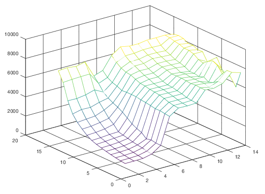

# 6.24
平均寻道时间：4ms
平均旋转时间：2ms

A：同一个盘面，顺序存储，文件有2MB，需要4000个逻辑块，跑4圈
寻道时间4ms，平均旋转延迟2ms,连续转动四圈
time = (4ms + 2ms) + 4ms * 4 = 22ms

B：每次到要进行寻道
time = (4ms + 2ms) * 4000 = 24s

# 6.28
A:无

B:0x18F0 - 0x18F3 0xB0 - 0xB3

C:0x0E34 - 0x0E37

D:0x1BDC - 0x1BDF

# 6.32
A:

```asciidoc
  12   11   10    9    8    7    6    5    4    3    2    1   0
+----+----+----+----+----+----+----+----+----+----+----+----+----+
|  1 |  0 |  1 |  1 |  0 |  1 |  1 |  1 |  0 |  1 |  0 |  0 |  0 |
+----+----+----+----+----+----+----+----+----+----+----+----+----+
```

B:

|参数    | 值 |
|-------|----|
|CO     |0x00|
|C1     |0x02|
|CT     |0xB7|
|Hit    | 否  |
|返回字节| -- |


# 6.36
A: 数组地址如下:
- x[0][i] 地址: i * 4
- x[1][i] 地址: (128+i)4 = 512 + i * 4

  二者会被转入到同一缓存组，不命中率100%

B:整个数组都可以被装入，所以仅在每一组的第一次访问时发生miss，
一组可以存放4个int，所以不命中率是1/4=25%

C: 数组地址如下:
- x[0][i] 地址: i * 4
- x[1][i] 地址: (128 + i) * 4 = 512 + i * 4

二者被存入同一组，不会发生冲突，不命中仅在第一次读入时发生，不命中率为25%  
后64个int与前64个int一样，不命中率也是25%  
整体不命中率25%

D:不一定，只要B仍然是16,读入数组时总是读入四个，不命中仅在第一次读入时发生，不命中率总是25%

E:会的，如果B=32,读入数组时读入8个ont，不命中仅在第一次读入时发生，不命中率是12.5%

# 6.38
A:4 * 16 * 16 = 1024
B:
```c
//不命中
square[i][j].c = 0
//命中
square[i][j].m = 0
square[i][j].y = 0
square[i][j].k = 0
square[i][j+1].c = 0
square[i][j+1].m = 0
square[i][j+1].y = 0
square[i][j+1].k = 0
```
不命中总数为 1024/8 = 128

C:1/8

# 6.40
A: 4 * 16 * 16

B: 第一个循环：不命中率是1/2 次数为16 * 16 * 1 * (1/2) = 128  
   第二个循环：不命中率是1/6 次数为16 * 16 * 3 * (1/6) = 128  
   总次数为：256

C: 256 / 1024 = 1/4

# 6.44

Clock frequency is approx. 2600.0 MHz
Memory mountain (MB/sec)

|  表  | s1 | s2 | s3 | s4 | s5 | s6 | s7 | s8 |s9 | s10 | s11 | s12 | s13 | s14 | s15 |
|-----|-----|----|----|----|----|----|----|----|---|---|---|---|---|---|---|
|128m |7603|6619|4935|3786|3133|2662|2250|1937|1759|1620|1487|1374|1279|1195|1133|
|64m  |7675|6688|4913|4001|3227|2711|2300|1976|1820|1649|1510|1390|1276|1201|1141|
|32m  |7561|6724|5049|3968|3302|2853|2408|2060|1900|1714|1559|1435|1339|1242|1164|
|16m  |7780|6747|5318|4251|3663|3042|2643|2095|1966|1857|1721|1631|1550|1460|1375|
|8m   |6063|5511|4846|4444|4169|3951|3657|3283|2894|2634|2447|2015|2134|2040|2023|
|4m   |6384|5884|5592|5438|5205|5254|5253|5247|5143|5098|5017|4914|4934|4855|4798|
|2m   |7714|7213|6841|6644|6575|6367|6162|6119|5994|5943|5860|5733|5560|5461|5421|
|1024k|8353|7645|7263|7040|6770|6520|6343|6109|5980|5945|5828|5711|5561|5449|5388|
|512k |8176|7653|7261|7046|6737|6511|6327|6115|5968|5933|5814|5716|5558|5487|5440|
|256k |8166|7773|7457|7316|7020|6893|6790|6616|6638|6642|6593|6537|6598|6554|6547|
|128k |8306|7769|7454|7241|7025|6858|6775|6533|6601|6518|6511|6501|6527|6365|6484|
|64k  |8295|7737|7399|7191|6943|6820|6658|6381|6408|6306|6491|6184|6369|6717|6754|
|32k  |8320|8272|8146|8044|7881|7871|7732|7385|7235|7632|7933|7665|7030|7605|7632|
|16k  |8173|8249|8170|7889|7916|7698|7721|6897|6858|7800|6889|6293|6526|5633|7355|



由图可以看出，我的系统的高速缓存大小如下：

| 缓存 | 大小  |
|-----|------|
| L1  | 32k  |
| L2  | 256k |
| L3  | 8M   |


