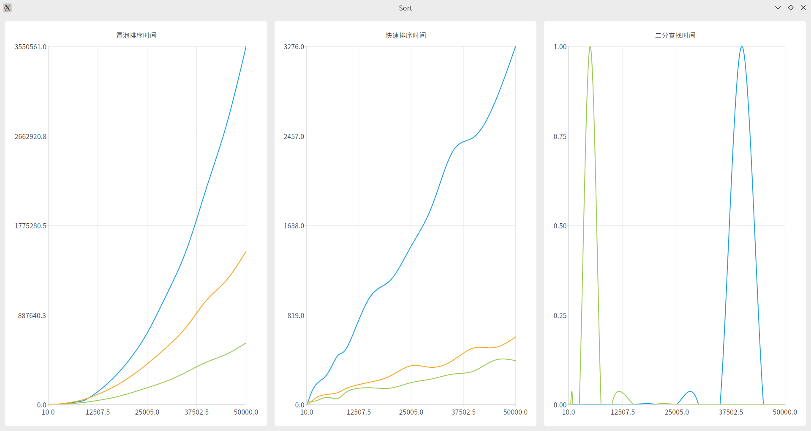

# 作业:查找结构与排序方法的实现与实验比较
查找(搜索)结构和排序方法是数据处理的基本操作。
## 要求:
1. 实现以下三组排序方法中的一组排序算法:
    - 冒泡排序和快速排序;
    - 插入排序和希尔排序;
    - 选择排序和堆排序。
2. 产生不同规模和分布的数据,以“图或表”的方式给出输入规模和分布对排序方法运行时间变化趋势的影响,并与理论分析结果比较。
3. 对上述已经排序的数据进行递归和非递归的二分(折半)查找。以“图或表”的方式给出折半查找方法的运行时间随输入大小(问题规模)的变化趋势,并与理论分析结果比较。
4. 注:上述“图或表”可以采用图片的形式(贴在 Word 文档中),与其他须提交的内容打包一起上传。

